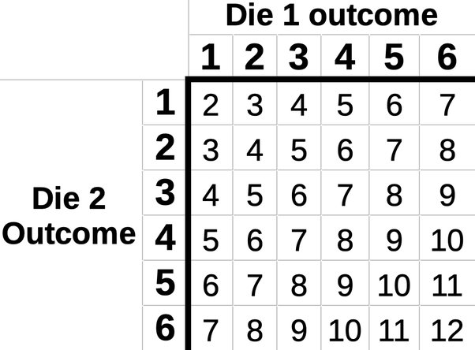

### Theorem 
This run says that Expected variable of the sum of two random variable can be find in individual calculation

#### Equation 
`E[x1 + x2] = E[x1] + E[x2]`

#### Example 
Suppose we are playing a game in which we take the sum of the numbers rolled on `two six-side dice`.
Calculate the expected value of the sum of the rolls

Total random variable will be = 6*6 = 36 

Discrite Random Variable : ` X = {{1,1},{1,2},{1,3},{1,4},[1,5},{1,6}, {2,1} ...} `  
The Probability Function : ` P = {1/36, 1/36, 1/36, 1/36, 1/36, 1/36} ...`  
Expectation : `E(x) = {2/36 + 3/36 + 4/36 + 5/36 + 6/36 + 7/36 ... } ` => `7`   
             

This can be also calculate with Linearity of Expected theorem,
First calculate for one dice and then another dice then sum up. 

Expected value for one dice is = 3.5 
So for two dice = 3.5 * 2 = 7

**Theorem Proved**

### Problem 
A fair coin is thrown N times, What is the expected number of Heads. 

### Solution 

A coin has two side `Head` or `Tail`. so the expectation will be `1/2` for a single coin. 
Then For `N`number of coin  `E(N) = E(e1 + e2 + e3 + e4 + ...+ en)`  
                           `E(N) = E(e1) + E(e2) + E(e3) + E(e4) + ... + E(en)`  
                           `E(N) = 1*1/2 + 1*1/2 + 1*1/2 + ... + 1*1/2` 
                           `E(N) = n/2` 

So If N number of coin this thrown then total n/2 number of coin will be fall as `Head`

