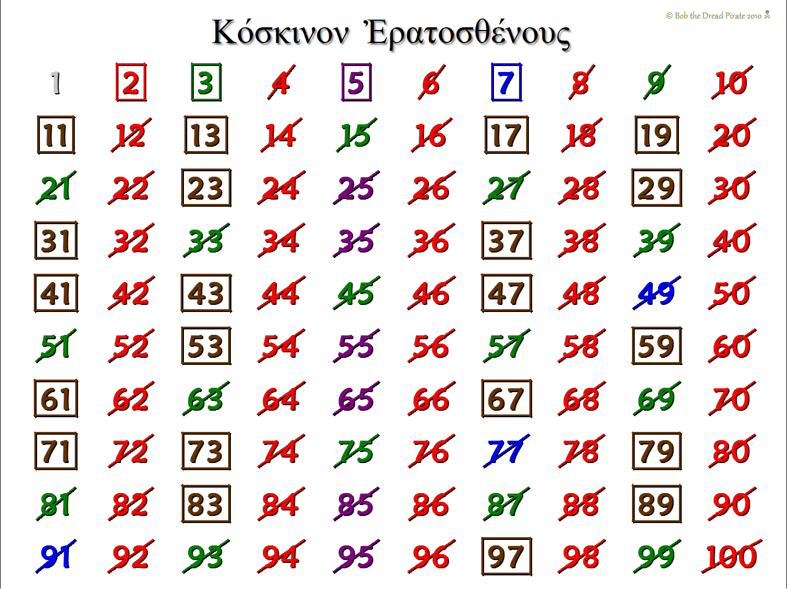

### Find all the prime number in a range 
Let's say find all the prime number from 0 to 1000. If the general methods is used then  the complexity will be large `O(n^2)`. This complexity can be lower down to `O(n*sqrt(n))` using a theorem called `sieve of eratosthenes`. 
### Solution


### Explanation
First mark 1 is a prime number. Then start with 2 and mark 2 prime number. But all the others number in the picture with is divide by 2 is not a prime number.
So mark those number as a not prime number. 
Now pick next number which is not mark down as not prime which is 3 and mark 3 number as a prime number and also mark all the number which is divide by 3 like 6,9,12,15 ...

Again look for next number which is not marked as not prime number which is 5. Mark it as prime number and also mark all the number as not prime number which is divide by 5. 

Do the same until reach in the end.


```cpp
#include<iostream>
#include<vector>
using namespace std;
#define N 1000000
#define ll long long

void primeSieve(vector<int> &sieve){

	//Mark 1 and 0 as not prime
	sieve[1] = sieve[0] = 0;

	// Initially you can say I will just mark all odd numbers as prime
	for(int i=3; i<=N; i+=2){
		sieve[i] = 1;
	}

	//start from 3 and mark all multiples of given i (prime) as not prime
	for(ll i=3; i<=N; i++){	
		if(sieve[i]){
			for(ll j = i*i; j<=N; j = j + i){
				//marking j as not prime
				sieve[j] = 0;
			}
		}
	}
}


int main(){

	vector<int> sieve(N+1,0); //fill constructor
	primeSieve(sieve);

	for(int i=0; i<=1000; i++){
		if(sieve[i]){
			cout<<i <<" ";
		}
	}
	

	return 0;
}
````

