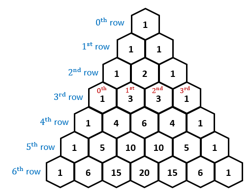

### Binomial Coefficient

A binomial coefficient `C(n,k)` also gives the number of ways, disregarding order, that `k` object can be chosen from among `n` objects.

#### Factorial Method for finding binomial coefficient

Just find in the iterative way for finding `nCr` is `n!/(k! * (n-k)!)`.

```cpp
// Function to compute nCr (binomial coefficient)
unsigned long long binomialCoefficient(int n, int k) {
    // Base cases
    if (k > n) return 0;
    if (k == 0 || k == n) return 1;

    // Since C(n, k) = C(n, n-k)
    if (k > n - k) k = n - k;

    unsigned long long result = 1;

    // Compute value of [n * (n-1) * ... * (n-k+1)] / [k * (k-1) * ... * 1]
    for (int i = 0; i < k; ++i) {
        result *= (n - i);
        result /= (i + 1);
    }

    return result;
}
```

#### Using pascal's Triangle methods



In the triangle, first and last triangle element will always be 1. But in the middle element can be computed using this equation.<br>

`nCr = (n-1)Cr + (n-1)C(r-1)` <br>

If we are using array then, `arr[n][r] = arr[n-1][r] + arr[n-1][r-1]`

**Bottom up approach to find pascal triangle**

```cpp
  int binomialCoefficient(int n, int k){
    vector< vector<int>> table(n+1, vector<int>(k+1, 0));
    for(int i=0;i<=n;i++){
      for(int j = 0; j<=min(i,k); j++){
        // base case
         if(j==0 || j==i) table[i][j] = 1;
         else {
          table[i][j] = table[i-1][j-1] + table[i-1][j];
      }
    }
   }
     return table[n][k];
  }
```
