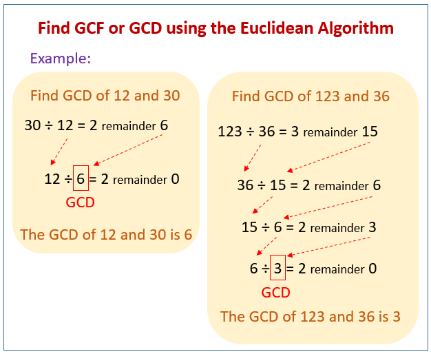

### greatest common divisor

GCD of two number `a` and `b` is the greatest number which is divide both `a` and `b`. To find the gcd in brute force way is go from 1 to `min(a,b)` and check which greatest number is divide both `a` and `b`,
Brute force algorithm to find GCD :

```cpp
 int findGCD(int a, int b){
   int ans = 1;
   for(int i=1;i<min(a,b); i++){
      if(a%i == 0 && b%i == 0) {
       ans = i
   }
  }
  return ans;
}
```

### Euclidean way to find the gcd

The Euclidean algorithm is a method for finding the greatest common divisor (GCD) of two integers. The GCD of two integers is the largest integer that divides both of them without leaving a remainder. This algorithm is efficient and has been known for over two thousand years, originating from ancient Greek mathematician Euclid



###### Find the GCD of two number

**GCD(a,b)**

1.  find the remainder using `a%b`.
2.  if the remainder is `0` then GCD is `b`
3.  otherwise called the `GCD(b, a%b)`

Efficiency: The Euclidean algorithm is very efficient, with a time complexity of `O(log(min(a,b)))`

```cpp
int gcd(int a, int b) {
    while (b != 0) {
        int temp = b;
        b = a % b;
        a = temp;
    }
    return a;
}
```
